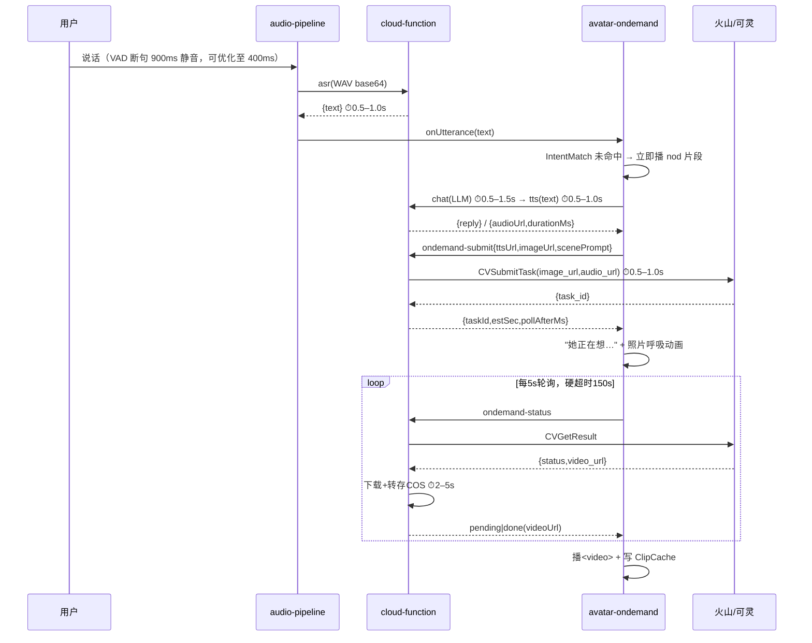

# 点播式重逢 · 详细系统设计（T0 + T1）

> 项目：云念 AI · 作者：Bob（架构） · 日期：2026-09-11 · 上游：`docs/数字人实时化架构评估.md`
> **本文件只做设计，不改任何现有代码。** 行号基于 2026-09-11 代码快照，实施前复核。

---

## 0. 三处重要修正（先看）

| # | 上一版 | 修正后 | 原因 |
|---|---|---|---|
| 1 | 云函数加 3 个 action | **要加 4 个**：`tts`/`ondemand-submit`/`ondemand-status`/`warmup` | 点播生成需要**音频 URL** 入参；现有只有浏览器 `speechSynthesis`（`js/ai-call.js:436`），iOS Safari 无法录制其输出，**必须接云端 TTS**。这是漏掉的硬依赖 |
| 2 | 火山视频克隆"便宜 5–10 倍" | **仅 2.5–4 倍，回本点 578–1733 条** | 2599 元建形象 + 0.1 元/秒；5 秒片段 0.5 元 vs 可灵 2.0 元（省 1.5 元/条 → 1733 条回本）、vs OmniHuman 5.0 元（省 4.5 元/条 → 578 条回本）。低频角色不划算 |
| 3 | 降级方案 5 人天 | **9 人天** | 新增 TTS 依赖 + 视频 URL 有效期约 1 小时需转存 COS + 等待动效三件套 |
| 4 | 生成等待 20–45s | **90–150s** | OmniHuman 1.5 官方 **720P RTF=23 / 1080P RTF=27**，5 秒成片约 115–135s。轮询改 5s、硬超时改 150s、**方案乙（先播声音）升级为必做** |
| 5 | "生活流水录像可克隆" | **素材假设不成立，克隆不做主线** | 硬门槛 >25fps 且码率 >20Mbps（家庭录像 2–8Mbps 出局）+ 开头静默 10s + 连续自述 3–5 分钟。合格素材只有"对镜讲话类" |

**新增利好发现**：火山 2D 克隆数字人官方口径是「**仅口型由 AI 生成，头部/身体/背景全部保留录制时的样子**」。若家属提供的是有生活场景的录像（院子里择菜、厨房做饭），生成的视频**背景天然在动、永不崩坏、一致性 100%**，比生成式模型更稳 → 定位**付费高级档**。

---

## 1. 文件清单与职责

### 1.1 目录结构

```
js/config.js                  [改] 新增 AVATAR_PROVIDER / VIDEO_VENDOR / CLIP_BASE
js/ai-call.js                 [改] 瘦身：只留 UI/计时/记忆
js/avatar/avatar-adapter.js   [新] 统一门面+状态机（唯一对外入口）
js/avatar/avatar-ivh.js       [新] IVH 实现（从 ai-call.js 迁出，逻辑不变）
js/avatar/avatar-ondemand.js  [新] 点播实现（L1/L2 主角）
js/avatar/audio-pipeline.js   [新] VAD+ASR（从 ai-call.js 抽出）
js/avatar/clip-cache.js       [新] 片段索引与本地缓存（LRU 200 条）
js/avatar/intent-match.js     [新] 意图匹配（L1 命中判定）
cloud-function/index.js       [改] 新增 4 个 action（插在 :360 asr 之后、:385 兜底之前）
index.html                    [改] script 加载顺序 + 2 个新 DOM + 1 条 CSS
```

### 1.2 `avatar-adapter.js` 统一契约

```js
const AvatarAdapter = {
  start(config)   // {charId,name,photoUrl,voice,memTexts} → {code}
  speak(text,opts)// opts:{emotion,onStart,onFirstFrame} → {code, via:'clip'|'gen'|'tts'}
  interrupt()     // 打断当前播放 / 取消进行中的生成
  stop()          // 释放资源回 idle
  getState()      // 'idle'|'connecting'|'ready'|'speaking'|'closed'
  on(event,cb)    // 事件：state / error / log
};
```
**状态机**：`idle --start()--> connecting --就绪--> ready --speak()--> speaking`；`connecting` 失败/超时 → `closed`；`stop()` 或播放结束 → `idle`。
- `connecting` 最长 40s（沿用 `ai-call.js:156-164` 看门狗），超时强制 `ready` 并降级演示模式
- `speaking` 期间再 `speak()` → 先 `interrupt()` 再播（抢话场景）
- 任何异常 → 记日志 + 回落 `via:'tts'`（照片+语音），**绝不抛给 UI**

**错误码**（沿用云函数 `{code,message}` 风格）：`0`成功｜`1`参数缺失｜`2`网络/超时（重试1次→回落tts）｜`3`未配置（直接回落演示模式+Toast）｜`4`供应商错误（回落tts）｜`5`配额不足（提示"今日额度用完"）｜`9`provider未实现

### 1.3 `audio-pipeline.js`（从 ai-call.js 抽取，行号已核实）

| 新函数 | 来源 | 说明 |
|---|---|---|
| `floatToWav(samples,srcRate)` | `aiFloatToWav` **687–702** | 原样搬 |
| `startListening(opts)` | `aiListenStart` **704–755**（VAD 在 `onaudioprocess` **722–750**） | 加 `onUtterance` 回调 |
| `stopListening()` | `aiListenStop` **757–762** | 原样搬 |
| `transcribe(wavB64)` | `aiUtterance` **764–785** 中 `cfPost('asr')` 部分 | 独立成函数，便于换 ASR |
| `setDeafUntil(ms)` | `aiDeafUntil`(**676**) + `aiSpeak` 内 **425** 的计算 | 说话前防回声 |
| `listenUI(state)` | `aiListenUI` **678–684** | 操作 `#aicListen` |

**保留不动**：`aiSRSupported` **544-546** / `aiStartRecognition` **548-572** / `aiStopRecognition` **574-580**（Web Speech 兜底链路，与 AudioPipeline 二选一）。

**ai-call.js 必须改的调用点**

| 行号 | 现状 | 改为 |
|---|---|---|
| 409 / 671 | `aiListenStart()` | `AudioPipeline.startListening({onUtterance})` |
| 986 | `aiListenStop()` | `AudioPipeline.stopListening()` |
| 428 | `if(aiCallReal) return ivhSpeak(text)` | `return AvatarAdapter.speak(text)` |
| 230–300 | `aiIvhCallFlow()` 整段 | **删除**迁至 `avatar-ivh.js`，原位改 `AvatarAdapter.start(cfg)` |
| 773 | `cfPost('asr',…)` | `AudioPipeline.transcribe(b64)` |
| 312–331 | `ivhSpeak()` | **删除**迁至 `avatar-ivh.js` |
| 675–676 | `aiVad` / `aiDeafUntil` | 删除（状态移入 audio-pipeline） |
| 28–31 | `aiIvhSessionId`/`aiIvhTrtc`/`aiIvhRemoteUserId`/`aiIvhPollTimer` | 删除（`aiCallReal` 保留） |

### 1.4 `clip-cache.js` / `intent-match.js`

```js
ClipCache.get(charId,text)->{url,intent,ts}|null   // 归一化 hash 精确命中
ClipCache.put(charId,text,url,intent) / .byIntent(charId,intent) / .prewarm(charId,manifest)  // LRU 上限 200 条
IntentMatch.match(text)->{intent,score}            // 关键词+正则
IntentMatch.matchByLLM(text,intentList)->intent|null // 兜底，复用 cfPost('chat')
```

### 1.5 `index.html` 改动

1. 在 **898 行** `ai-call.js` **之前**插入（顺序即依赖顺序）：`clip-cache.js` → `intent-match.js` → `audio-pipeline.js` → `avatar-ivh.js` → `avatar-ondemand.js` → `avatar-adapter.js`（均带 `?v=20260911a`）
2. 在 `#aicConnected`（**451**）内、`#aicFullPhoto`（452）之后插入：
   `<video id="aicClipVideo" playsinline style="display:none"></video>` 与 `<div id="aicThinking" style="display:none">她正在想…</div>`
3. CSS：`#aicFullPhoto.breathe{animation:breathe 4s ease-in-out infinite}`（scale 1→1.03）

## 2. 云函数新增 4 个 action

> 沿用现有 `parseQuery`（`cloud-function/index.js:117-148`）取参、`json(status,{code,…})` 返回。

**① `tts`（新增硬依赖，P0）**
```json
// 请求 { "action":"tts", "text":"哎，好孩子，我挺好的", "voiceType":"601003", "format":"wav" }
// 响应 { "code":0, "audioUrl":"https://…/tts/ab12.wav", "durationMs":4200 }
//       { "code":3, "message":"未配置 TTS_SECRET_ID / TTS_SECRET_KEY" }
```
腾讯云语音合成，复用现有 `tc3Post`（host `tts.tencentcloudapi.com`，Action `TextToVoice`，Service `tts`，Version `2019-08-23`）。**音频必须落成 COS URL**——火山/可灵只收 `audio_url`，不收 base64。

**② `ondemand-submit`**
```json
// 请求 { "action":"ondemand-submit", "charId":"c_123", "text":"我挺好的，你放心",
//        "imageUrl":"https://…/photo.jpg", "resourceId":null,
//        "scenePrompt":"在老家院子里，阳光很好，笑着看向镜头",
//        "ttsUrl":"https://…/tts/ab12.wav", "vendor":"omni" }
// 响应 { "code":0, "taskId":"14411597596416601128", "vendor":"omni", "estSec":28, "pollAfterMs":3000 }
```

**③ `ondemand-status`**
```json
// 请求 { "action":"ondemand-status", "taskId":"…", "vendor":"omni" }
// 响应 { "code":0, "status":"pending", "progress":40 }
//       { "code":0, "status":"done", "videoUrl":"https://…/cos/clips/ab12.mp4", "durationSec":5.2, "costYuan":1.56 }
//       { "code":0, "status":"failed", "message":"Input invalid for this service" }
```
⚠️ 供应商返回的 `video_url` **有效期约 1 小时**（社区实测，官方未承诺）→ `done` 时**必须**下载转存 COS 后再返回。

**④ `warmup`**：`{action:'warmup', charId, imageUrl, resourceId, intents:[…30 个]}` → `{code:0, accepted:30, jobId:'w_88'}`；对 30 个意图各生成 1 条 3–5 秒片段，**串行提交（并发限额 1）**，预计 15–25 分钟。状态查询复用 `ondemand-status`（`vendor:'warmup'`）。完成前角色仍是"创建中"，需把 `js/app.js:297` 的 `CHAR_READY_AFTER_MS`（3 分钟）改为轮询 warmup 状态。

---

## 3. 三层降级的数据流

### 3.1 L1 预热片段库

**30 条意图清单**（每条 3–5 秒，命名即 `intent`）

| 分组 | 意图 | 示例台词 |
|---|---|---|
| 开场(4) | `greet` `longtime` `justnow` `recognize` | "哎，你来啦，我在这儿呢"/"好久没听见你声音了"/"我刚还在念叨你呢"/"是你啊，声音都没变" |
| 情感(5) | `miss` `howareyou` `cry` `forget` `dream` | "我也天天想你"/"我挺好的，别惦记"/"别哭，我在呢"/"怎么会忘了你"/"我昨儿还梦见你小时候" |
| 生活(6) | `eat` `body` `cold` `work` `night` `money` | "刚吃过，锅里给你留着呢"/"身体硬朗着呢"/"天冷了多穿点"/"别太拼，钱够花就行"/"睡吧，做个好梦"/"我不缺钱，你自己留着" |
| 记忆(4) | `childhood` `dish` `yard` `lasttime` | "你小时候最黏我了"/"还是你爱吃的那道菜"/"院子里的树又长高了"/"上次你说的那事儿，后来咋样了" |
| 回应(5) | `listen` `agree` `comfort` `takecare` `comeoften` | "嗯嗯，我在听呢"/"你说得对，听你的"/"别难过，都会好的"/"把自己照顾好"/"有空常来跟我说说话" |
| 收尾(3) | `bye` `nexttime` `takecare2` | "去忙吧，我在这儿"/"下次再聊"/"保重啊，孩子" |
| 静默兜底(3) | `nod`(倾听点头2s循环) `think`(思考4s循环) `smile`(轻笑2s) | 无台词，只做表情/姿态 |

**匹配算法（三级瀑布）**

| 级 | 方法 | 成本 | 延迟 | 预期命中 |
|---|---|---|---|---|
| 1 | `ClipCache.get` 归一化 hash 精确命中 | 0 | 0ms | 15–25%（重复问句/二次通话） |
| 2 | `IntentMatch.match` 关键词+正则（**复用 `ai-call.js:513-524` 的 `R` 规则表**，扩到 30 条） | 0 | <5ms | 35–45% |
| 3 | `IntentMatch.matchByLLM` 走现有 `cfPost('chat')`（`ai-call.js:634`） | ~0.0001 元 | 300–800ms | 再 +10–15% |
| 未命中 | → L2 现场生成 | 2–5 元 | 90–150s | 剩余 25–35% |

**综合预期 L1 命中率 60–70%**（开场白/寒暄/情感类几乎必中；开放式问题与知识问答必走 L2）。二次通话命中率会随缓存累积自然升高。
**零感延迟关键**：不等匹配完成再播。`speak()` 立即先播 1.5s 的 `nod` 覆盖思考时间，匹配结果出来后无缝接上目标片段 → 用户感知延迟≈0。

### 3.2 L2 现场生成（时序图）



**耗时与超时**

| 阶段 | 预估 | 超时 | 超时动作 |
|---|---|---|---|
| VAD 断句 | 0.9s（可优化 0.4s） | — | — |
| ASR | 0.5–1.0s | 25s（沿用 `ai-call.js:773`） | "没听清"，回聆听 |
| LLM | 0.5–1.5s | 20s（沿用 `ai-call.js:634`） | 回落 `aiReply` 规则引擎(:497) |
| TTS | 0.5–1.0s | 10s | 回落 `speechSynthesis` |
| 提交任务 | 0.5–1.0s | 15s（`cfPost` 默认） | 重试1次→演示模式 |
| **生成等待** | **90–150s**（RTF 见下） | **150s** | 见下 |
| 转存+播放 | 2–5s | 15s | 用临时 URL 直播 |
| **合计** | **约 2–3 分钟** | | |

⚠️ **生成耗时重大修正**：OmniHuman 1.5 官方标称 **720P RTF=23 / 1080P RTF=27**（RTF=生成耗时÷成片时长），即 5 秒成片约需 **115 秒(720P) / 135 秒(1080P)**，远慢于上一版估的 20–45s。→ 统一输出 **720P**、轮询 3s→**5s**、硬超时 60s→**150s**。这是点播方案最大的体验风险。

**等待期四级降级**（每级都有画面，禁止白屏/静止照片）：`0–3s` 播 `nod`（2s 循环）→ `3–15s` `#aicThinking`"她正在想…"+`breathe` 呼吸动画 → `15–60s` 播 `think`（4s 循环，2–3 段交替防重复）→ `60–150s` **插播 L1 垫场片段**（`childhood`/`dish`/`yard` 回忆类，把等待变成"她想起了以前的事"）→ `150s` 放弃视频改**音频先播**，后台继续生成并写缓存。

**进阶（方案乙）**：TTS 音频一到就先播声音（t≈3s 可听），画面保持呼吸动画；视频生成完再切（静音 `<audio>`、`<video>` 从头播，1–2 秒语音重复）。感知延迟 150s→3s。**在 RTF=23 的前提下，方案乙从"可选"升级为"必做"**，否则用户要盯照片等 2 分钟。

### 3.3 L3 实时兜底
`AVATAR_PROVIDER` 切 `vivix`/`volc` 即可，门面不变；`avatar-ondemand.js` 保留作兜底（实时流异常自动回落点播）。

## 4. 素材策略

### 4.1 有录像 → 火山克隆（高阶档，**不做主线**）

技术形态成立（`templ_start_strategy="start_from_given_seconds"` + 官方明写"自动对模板时长取余" → 模板视频**循环复用为动作底板、只换口型**），**但素材入口几乎不存在**。
**硬门槛**（火山《数字人形象-视频拍摄指引》）：3–5 分钟、**一镜到底禁止剪辑**（剪辑会训练跳帧）、mp4、≤1G；**>25fps 且码率 >20Mbps**（致命项：微信转存/早期 DV 转录只有 2–8Mbps）；≥720p（推荐 1080P/4K）；**单人**、头部转动 **≤30°**、**眼睛平视**、人物居中不出画面；明令"不要边走边说""画面不要过快晃动"（手持跟拍出局）；**开头静默闭嘴 10 秒（无人声）**后**本人连续讲满 3–5 分钟**。
→ **家庭流水录像（院子里择菜/厨房做饭）几乎全部不合格；真正可能达标的只有"对镜讲话类"：自拍 vlog、婚礼/生日致辞、讲课录像。** 必须做**前置素材体检**，不合格引导回照片档。

**接入链**（`visual.volcengineapi.com`，Region `cn-north-1`，Service `cv`）

| 步 | Action | req_key | 入参 | 出参 |
|---|---|---|---|---|
| 1 | `CVSync2AsyncSubmitTask` | `url2vid` | `{video_url}` | `task_id` |
| 2 | `CVSubmitTask` | `realman_avatar_training_task_streaming` | `{vid}` | `task_id` |
| 3 | `CVGetResult` | 同上 | `{task_id}` | `resp_data.resource_id` |
| 4 | `CVSubmitTask` | `realman_avatar_creation_task` | `{resource_id, audio_url}` | `task_id` |
| 5 | `CVGetResult` | 同上 | `{task_id}` | `video_url` |

步 3 训练耗时官方示例 `training_duration:3805`（**≈63 分钟**，必须异步）；步 4 音频 mp3/wav（推荐 wav），成片 ≤12 分钟；**全流程并发限制 1**（最大工程约束）。
⚠️ **返回解析坑**：`resource_id` **不在返回顶层**——`data.resp_data` 是 **JSON 字符串**，必须 `JSON.parse` 二次解析才拿得到 `resource_id`/`frontend_pic`/`training_duration`；生成结果的 `video_url` 在 `data.resp_data.vid.url`。

### 4.2 只有照片 → 生成式（默认档）
**首选 可灵「数字人」0.4 元/秒(720P)**（待确认是否接受图片+音频）；**备选 OmniHuman 1.5**（即梦同源，`req_key=jimeng_realman_avatar_picture_omni_v15`，入参 `{image_url,audio_url}`，720P/1080P，音频 ≤60s 建议 ≤15s、超 60s 报 `50215`，15s 后结构稳定性衰退，图片建议"闭嘴正面照"）。
生成式：人物与**背景都由模型生成且都会动** ✅，代价是身份一致性不如克隆、有漂移。

### 4.3 成本对比（已按核实价重算）

| 方案 | 建形象 | 5 秒片段 | 30 条预热 | 单次通话(10轮/65%命中) | 一致性 | 背景 |
|---|---|---|---|---|---|---|
| **A 克隆**（对镜录像） | **2599 元/人** | **0.5 元** | 2599+15 元 | 2599 一次性+约 2 元 | ★★★★★ 永不崩坏 | ★★★★ 原录像背景，天然在动 |
| **B 可灵数字人**（照片） | 0 | **2.0 元** | **60 元** | 约 **7 元** | ★★★ 有漂移 | ★★★★ |
| C OmniHuman 1.5（照片） | 0 | **5.0 元** | 150 元 | 约 **18 元** | ★★★ | ★★★★★ 生成式，会变 |
| D 实时（火山 API） | — | — | — | **3 万元/月** | ★★★ | ★★★★★ |

ⓘ **OmniHuman 1.5 = 1 元/秒 已核实**（火山 docs/6313/1834143，2026-09-11），**上一版的 0.3 元/秒作废**（那是另一服务族）。
**选型修正**：默认走 **B 可灵（照片，2 元/条）**；C 因 1 元/秒 + RTF 23 降为备选；**A 克隆不做主线**，做「高阶模式 + 前置素材体检」。回本点：A vs B = 2599÷1.5 ≈ **1733 条**，A vs C = 2599÷4.5 ≈ **578 条**。A 的卖点是**永不崩坏 + 背景是真的**，不是便宜。

## 5. 任务分解（≤1 人天粒度）

| ID | 任务 | 文件 | 依赖 | 人天 | 并行 |
|---|---|---|---|---|---|
| T01 | 骨架：`js/avatar/`、config 加 `AVATAR_PROVIDER`、index.html 加 script+DOM+CSS | config.js, index.html | — | 0.5 | ✅ |
| T02 | `audio-pipeline.js` 抽取（floatToWav/startListening/stopListening/transcribe/setDeafUntil） | audio-pipeline.js, ai-call.js:675-785 | T01 | 1.0 | ✅ 与 T04/T05 |
| T03 | `avatar-adapter.js` + `avatar-ivh.js`（IVH 迁移，保证不回退） | 2 新文件, ai-call.js:230-331 | T01 | 1.0 | ✅ 与 T04/T05 |
| T04 | `intent-match.js` + 30 条意图规则表（复用 `ai-call.js:513-524`） | intent-match.js | T01 | 0.5 | ✅ |
| T05 | `clip-cache.js`（LRU + 意图索引） | clip-cache.js | T01 | 0.5 | ✅ |
| T06 | 云函数 `tts`（腾讯云 TTS + 音频落 COS） | index.js | — | 0.5 | ✅ 与前端 |
| T07 | 云函数 `ondemand-submit`（omni/clone/kling 三 vendor 分发） | index.js | T06 | 1.0 | |
| T08 | 云函数 `ondemand-status`（轮询 + **下载转存 COS**） | index.js | T07 | 1.0 | |
| T09 | 云函数 `warmup`（30 意图串行，并发 1） | index.js | T07 | 0.5 | |
| T10 | `avatar-ondemand.js`：L1 命中播 / L2 提交轮询 / 三级降级 / 写缓存 | avatar-ondemand.js | T02,T03,T04,T05,T07,T08 | 1.0 | |
| T11 | 等待动效：`nod`/`think` 循环片段 + `#aicThinking` + breathe CSS | index.html, avatar-ondemand.js | T10 | 0.5 | |
| T12 | 联调 + 埋点（命中率/耗时/成本）+ 演示模式兜底验证 | 全部 | T11 | 1.0 | |
| | | | **合计** | **9.0** | |

**关键路径**：T01→T02/T03→T10→T11→T12（约 6 人天）；T06–T09 与前端并行不阻塞。
**最大不确定性**：T07/T08 的供应商返回结构。**建议先花 0.5 天做供应商接口冒烟**（用官方测试形象 `250623-zhibo-linyunzhi` 跑通一次全流程）再写正式代码。

## 6. 新增风险

| # | 风险 | 缓解 |
|---|---|---|
| R9 | 视频 URL 有效期约 1 小时（社区实测） | 云函数拿到即转存 COS；失败则用临时 URL 直播并放弃缓存 |
| R10 | 并发限制 1 | 前端同一时刻只允许 1 个生成任务；warmup 串行；多用户排队+拒绝提示 |
| R11 | 克隆训练 ≈63 分钟 | 异步轮询；UI 告知"正在学习 TA 的样子，约 1 小时"；期间用照片模式 |
| R12 | TTS 音色不像逝者 | 短期调节语速/音调+预期引导；长期评估声音复刻（成本与合规另议） |
| R13 | 成本被刷（2–5 元/次） | 单用户日限额 + 每角色预热上限 30 条 + 账单告警 |
| R14 | 老照片质量差（侧脸/模糊/低分辨率） | 上传端照片体检；Omni/可灵建议闭嘴正面照 |
| R15 | **生成 RTF 23–27，单轮等待 2 分钟** | 720P 输出 + 方案乙（音频先播）+ 四级垫场动效；长等待时主动引导用户"聊点别的" |
| R16 | 用户拿来的录像不达标却执意要克隆 | 前置素材体检（时长/码率/帧率/单人/正脸/静音开头），不合格明确告知原因并引导回照片档 |

## 7. 成本数字来源与待确认（查询日期 2026-09-11）

| 数字 | 来源 |
|---|---|
| 火山克隆：建形象 2599 元/个、生成 0.1 元/秒、并发 1 | 火山《克隆数字人·能力介绍》docs/86081/1804568 |
| 克隆 API 四个 req_key（url2vid / realman_avatar_training_task_streaming / realman_avatar_creation_task）与训练耗时 3805s | docs/85128/1773809、docs/86081/1804570、docs/85128/1773810 |
| 视频拍摄指引（3–5min/≥720p/>25fps/20–50Mbps/≤1G） | docs/6313/1804569 |
| **OmniHuman 1.5：1 元/秒、并发 1、720P RTF=23 / 1080P RTF=27、音频≤60s建议≤15s、15s后衰退** | docs/6313/1834143（含 req_key docs/85621/1829013）；另见算点表 docs/86081/1805689「omnihuman1.5 数字人 10 算点/秒 = 1 元/秒」 |
| 可灵数字人 0.4 元/秒(720P) | klingai.com/dev/pricing |
| 火山实时互动数字人 API 3 万/并发/月 | docs/86081/2387261 |
| "2D 克隆仅口型由 AI 生成，其余保留录制原样" | 飞书《02如何克隆实景数字人》（第三方实践，**需与火山官方二次确认**） |

**待确认（阻塞 T07）**：①**可灵「数字人」是否接受图片+音频入参**（决定默认档能否用 0.4 元/秒，最高优先级）②可灵数字人的**生成耗时/RTF**（决定 150s 超时是否合理）③`data.resp_data.vid.url` 字段名二次确认（PM 已提示 `resp_data` 是 JSON 字符串需二次 parse）④腾讯云 TTS 在云函数内直出 COS 还是需先回 base64 ⑤克隆逝者形象的家属书面授权条款（待法务）。~~OmniHuman 1 元/秒~~ 已于 2026-09-11 核实。
